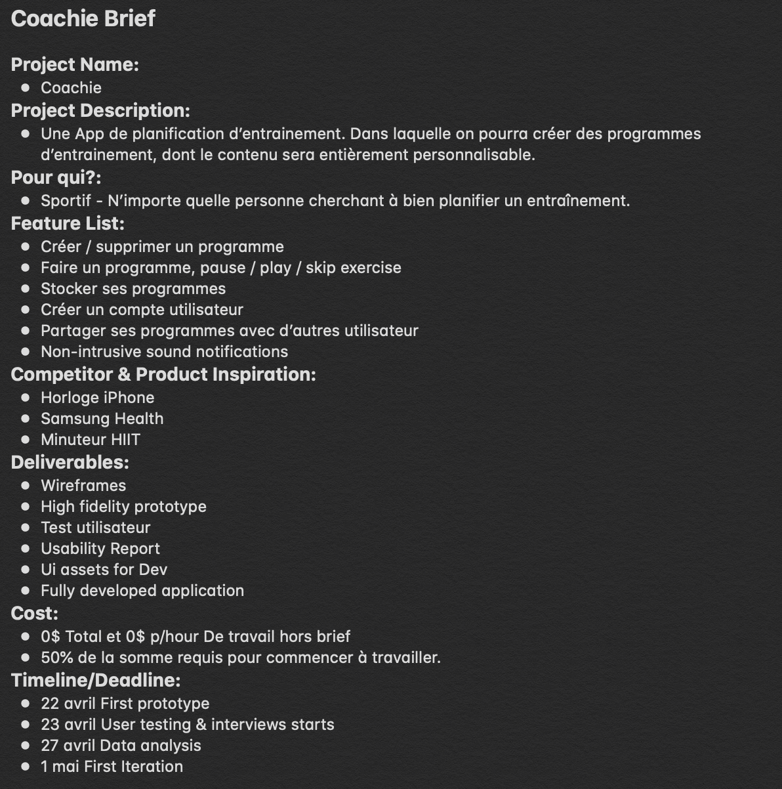
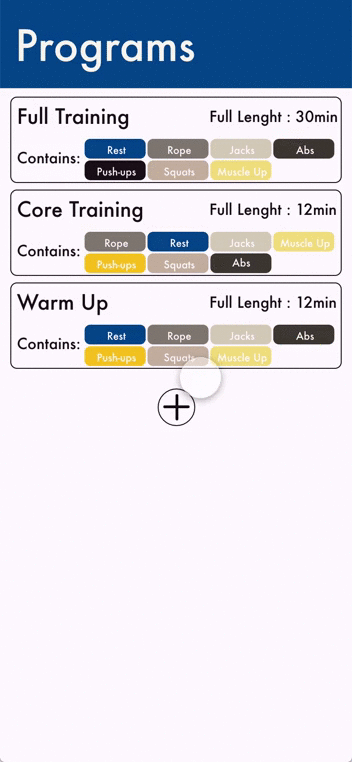
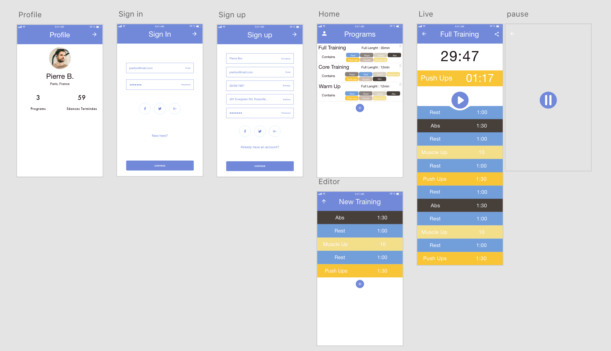
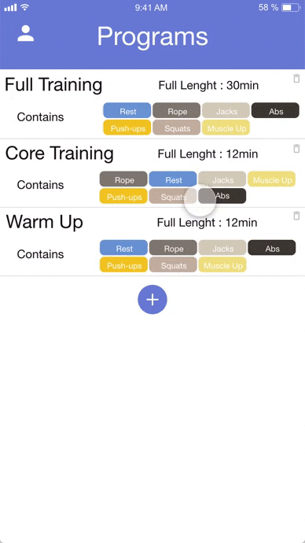

# Coachie

Il s'agit de mon premier projet utilisant les outils et méthodes de l'**UX Design**. Mon but est de concevoir une application permettant d'organiser ses entrainements en les programmant à l'avance.

Dans un premier temps, je fais des recherches sur les méthodes et outils les plus adaptés à mon projet. J'ai choisi de prendre en main **Adobe Xd**. Je me sers de ce que j'ai appris auprès de la **dthinking.academy**, et j'exploite toutes sortes d'informations touvées sur internet. Découvrant encore le domaine, j'alterne l'avancement de mon projet avec des recherches et des lectures.

Je commence par essayer de concevoir un **brief** comparable à ce qu'un client aurait pu m'envoyer, calqué sur un exemple professionel.
Cela me permet, déjà, de voir à quoi ressemble un **brief**, et surtout de poser des bases et des limites à mon projet.

- J'identifis mon **utilisateur**.
- Je définis les **features** que je veux pour l'instant.
- Je liste des applications dont je peux m'inspirer ou, qui sont en concurrence avec la mienne. 
- Je fais une liste de **delivrables** comme si j'avais un client, ça me permettra de me fixer des objectif et de construire une chronologie pour mon projet. 
- J'en profite aussi pour me poser des **deadlines** même si je n'ai pas encore la moindre idée du temps que peut me prendre chaque étapes, ni du nombre d'**itérations** que je vais faire. Mais ça va me permettre de réaliser l'écart qu'il y a entre ce que j'anticipait au début du projet et ce qui est réellement.

Ce **brief** n'a rien de définitif, puisque rien qu'en me limitant en terme de **features**, je passerai à côté de beaucoup d'aspect intéressants de la démarche. Il est voué à être mis à jour.

Ensuite j'élabore un **personna**. Le but est d'avoir un utilisateur type pour bien identifier ses besoins et ne pas concevoir une application pour moi ou pour qui que ce soit d'autre, mais au contraire de bien se focaliser sur la **cible de mon application** et de la garder au centre de la démarche.

 

Je commence à avoir une idée de ce que je veux faire. Je réunis de la docu, quelques tutos, et j'ouvre **Adobe Xd**.
Je commence un premier **wireframe** en multipliant les aller-retours sur google, pour comprendre le logiciel et exploiter ses outils au mieux tout en essayant de prendre de bonnes habitudes. 
Au bout de quelques heures, j'ai un premier résultat, un premier **userflow** à interroger grâce au mode **prototype** de **Xd**.

Mais le **design** ne me convient pas. La **pallette de couleurs** n'est pas satisfaisante et **l'interface** laisse à désirer.
Je décide donc de retourner dans une **phase de recherche**. 
J'améliore ma **palette de couleur**. Je télécharge des ressources mobile pour **Xd**. Notament, pour ne pas avoir à faire tout les boutons ou icones moi même. Ça me fait gagner beaucoup de temps et dans la plupart des cas, la qualité est meilleure que ce que j'aurais fait moi même. J'apprend, au passage, à faire des ajustements sur le travail d'un autre. 
Je télécharge ensuite des applications comparables. J'analyse leur **design**, autant en **micro**, par exemple pour les boutons play/pause qui sont souvent reunis en un bouton, qu'en **macro** quand il s'agit des choix de couleurs ou de l'organisation globale de chaque **frame**. Ne prévoyant presque que des modifications visuelles, je ne me pose pas trop de questions par rapport à mon utilisateur et je retourne dans **Xd** pour ameliorer mon **wireframe**.

Wireframe | Prototype
------- | -------
 | 

  

Après une première **itération**, je suis globalement satisfait du resultat, il y a encore des choses à rajouter par rapport au **brief** initial mais je pense que c'est suffisant pour l'instant. Je vais pouvoir commencer à montrer mon application, récolter du **feedback**, **interviewer** des utilisateurs potentiels et essayer de mettre en place des **testes utilisateur**.
