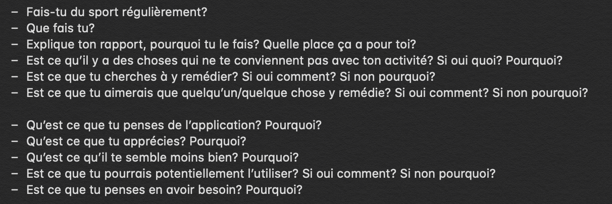

# Coachie

## Début
Il s'agit de mon premier projet utilisant les outils et méthodes de l'**UX Design**. Mon but est de concevoir une application permettant d'organiser ses entraînements en les programmant à l'avance.

Dans un premier temps, je fais des recherches sur les méthodes et outils les plus adaptés à mon projet. J'ai choisi de prendre en main **Adobe Xd**. Je me sers de ce que j'ai appris auprès de la **dthinking.academy**, et j'exploite toutes sortes d'informations touvées sur internet. Découvrant encore le domaine, j'alterne l'avancement de mon projet avec des recherches et des lectures.

Je commence par essayer de concevoir un **brief** comparable à ce qu'un client aurait pu m'envoyer, calqué sur un exemple professionel.
Cela me permet, déjà, de voir à quoi ressemble un **brief**, et surtout de poser des bases et des limites à mon projet.

- J'identifie mon **utilisateur**.
- Je définis les premières **features**.
- Je liste des **applications** dont je peux m'inspirer ou qui sont en concurrence avec la mienne. 
- Je fais une liste de **livrables** comme si j'avais un client, cela me permettra de me fixer des objectifs et de construire une chronologie pour mon projet. 
- J'en profite aussi pour fixer des **deadlines** même si je n'ai pas encore la moindre idée du temps que peut me prendre chaques étapes, ni du nombre d'**itérations** qui auront lieu. Ce qui va me permettre de réaliser l'écart qu'il y a entre ce que j'anticipais au début du projet et ce qui est réellement.

Ce **brief** n'a rien de définitif, puisque rien qu'en me limitant en terme de **features**, je passerais à côté de beaucoup d'aspects intéressants de la démarche. Il est voué à être mis à jour.

Ensuite j'élabore un **personna**. Le but est d'avoir un utilisateur type pour bien identifier ses besoins et ne pas concevoir une application pour moi ou pour qui que ce soit d'autre, mais au contraire de bien se focaliser sur la **cible de mon application** et de la garder au centre de la démarche.

 

## Protoypage

Je commence à avoir une idée de ce que je veux faire. Je réunis de la docu, quelques tutos, et j'ouvre **Adobe Xd**.
Je réalise un premier **wireframe** en multipliant les aller-retours sur google, pour comprendre le logiciel et exploiter ses outils au mieux tout en essayant de prendre de bonnes habitudes. 
Au bout de quelques heures, j'ai un premier résultat et un premier **userflow** à interroger grâce au mode **prototype** de **Xd**.

Mais le **design** ne me convient pas. La **palette de couleur** et l' **interface** ne sont pas satisfaisante.
Je décide de retourner dans une **phase de recherche**. 
J'améliore ma **palette de couleur**. Je télécharge des ressources mobile pour **Xd**. Notamment, pour ne pas avoir à designer tous les boutons ou icônes moi-même. Cela me fait gagner beaucoup de temps et dans la plupart des cas, la qualité est meilleure que ce que j'aurais fait. J'apprends, au passage, à faire des ajustements sur le travail d'un autre. 
Je télécharge ensuite des applications comparables. J'analyse leur **design**, autant en **micro**, par exemple pour les boutons play/pause qui sont souvent réunis en un bouton, qu'en **macro** quand il s'agit des choix de couleurs ou de l'organisation globale de chaque **frame**. Ne prévoyant presque que des modifications visuelles, je ne me pose pas trop de questions quant à mon utilisateur et je retourne dans **Xd** pour ameliorer mon **wireframe**.

Wireframe | Prototype
------- | -------
 | 

  

Après une première **itération** et une bonne amélioration du **prototype**, je suis globalement satisfait du résultat, je pense que c'est suffisant pour l'instant. Je vais pouvoir commencer à montrer mon application, récolter du **feedback**, **interviewer** des utilisateurs potentiels et mettre en place des **tests utilisateur**.

## Première phase de recherche

D'abord, bien que je n'ai pas d'objectif particulier avec ce processus de **research**, je conçois quelques questions pour guider un peu l'**interview** et me soutenir si jamais je perd un peu le file. Je dresse un profil du l'utilisateur puis je questionne au sujet de l'application. Mon but est de créer un **échange**, une discussion. Je veux créer un **lien avec mon utilisateur** et le comprendre, **sentir ses envies et ses besoins**. Je compte moins sur ces questions que sur ma capacité d'**empathie** pour avoir des réponses.

  

Ensuite, j'ai cherché des candidats. J'ai trouvé deux personnes dans mon entourage qui pratique quotidiennement une activité sportive, en tout cas en ce moment, et qui semble y avoir un rapport différent. Nouria, une jeune femme de 22 ans et Raphael, jeune homme de 23 ans. Les **interviews** plus les **test utilisateur** ont durés un peu plus d'une heure à chaque fois. C'était très intéressant et sympathique. J'en ai appris beaucoup sur la vision qu'ils avaient du sport et d'une bonne application. Cependant, peut être parceque mon prototype étant assez peu fonctionnel et abouti ou parceque j'ai eu un peu de mal à guider **l'échange**, il a été difficile d'avoir des retours clairs sur l'application. J'ai reçu plus de propositions pour de **nouvelles features** que **d'avis** ou de **ressentis** sur ce qui était déjà là. Ou en tout cas ils étaient moins précis que les propositions. C'était peut être juste que l'idée de base était convaincante et qu'ils ne se posaient pas de question, ce qui est une très bonne chose.

### Interviews

>Notes de l'interview de Nouria:
>
>- Fait du sport tout les jours.
>- Renforcement musculaire
>- Pour se sentir mieux, être plus dynamique, moins fatiguée.
>- Le fais en groupe donc trouve ça plutôt sympa. Il y a quand même des jours ou plus durs que d’autres.
>- Impatiente sur les résultats. Vu la période, c’est désagréable d’être limitée. 
>- En ce moment c’est le morale qui pèse un peu. Sinon le trajet pour aller a la salle. Emploie du temps parfois un peu serré.
>- Le groupe aide beaucoup pour la motivation (« x10 000 »). Pour la concentration, c’est mieux d’être seul.
>
>
>Test du prototype avec le navigateur:
>
>- Elle utilise l’application d’entrainement de sa salle : « il faut à chaque fois relancer les exos, ça serait mieux que ça >se lance tout seul ou que ça soit une option que les exos nous attendent pour se lancer ».
>- Pouvoir mélanger les reps et les timer est une très bonne idée. Elle aime pouvoir personnaliser le plus possible ses >entrainements.
>- Elles aiment recevoir des conseils d’exécution sur les exos.
>- Elle apprécie les suggestions d’exos qui complèteraient le programme de l’utilisateur.
>- Elle aimerait pouvoir voir le niveau de difficulté des entrainements.
>- Elle voudrait une bibliothèque d’exos pour les debutants ou ceux qui veulent découvrir de nouveau exos.
>- Peut être une bibliothèque d’entrainement personnalisée, des exos favoris ou des exos correspondant au profil utilisateur.
>- Elle apprécie beaucoup pouvoir préparer ses entrainements.
>- Elle voudrait un onglet communauté ou les utilisateurs pourraient partager leurs entrainements.
>- Elle aimerait avoir la possibilité de trié les trainings sur l’onglet communauté en fonction des likes ou des >telechargements des trainings ou d’autres
>- facteurs.
>- Elle apprécierait que l’application propose des entrainements en fonction du profil utilisateur.
>- Elle aimerait avoir un historique de modification des programmes pour sa progression.
>- Elle voudrait pourvoir trier ses entrainements en fonctions du contenu, de leur durée, de leur difficulté.
>- Elle veut pouvoir noter elle-même la difficulté de ses entrainements.
>- Elle trouve la possibilité de partager ses entrainements vraiment intéressante.
>- Les stats sont vraiment importantes pour elle, en particulier pour une application de sport.
>- Dans neoness (applis de sa salle) il y a beaucoup de possibilités pour trouver des entrainements dans leur bibliothèque. Il >y a des filtres pour choisir un entrainement en fonction du temps, des groupes musculaire, du lieu où le faire, selon ses >objectifs, et les sports qui nous plait. Et elle apprécie beaucoup ces fonctionnalités.
>- Elle veut à la fois, avoir beaucoup d’aide et en même temps être très libre de faire ce qu’elle veut comme elle le veut.
>- Elle aime être enrichie de plein de choses et qu’on la laisse faire ce quelle veut ensuite.
>- Elle voudrait qu’il y ait beaucoup de paramètres, pour adapter le fonctionnement et l’apparence de l’application en plus de >l’entrainement.
>- Si une application commence à lui déplaire, le sport aussi et elle pourrait assez vite laisser tomber. Le moindre détails >dérangeant et non modifiable peut suffire.
>- « Une application, je sais en 30sec si je vais la garder ou pas »
>- « Les applis de sport plus c’est intuitif, plus c’est complet, plus ça plait »
>- Elle l’utiliserait tout les jours. Parce qu’elle ne veut pas s’ennuyer et prendre du plaisir à faire du sport. La liberté >proposer lui plait beaucoup.
>- C’est pour elle une application qui manque, encore plus en temps de confinement. 
>- L’application plait beaucoup.
>- Elle préfère les design sobre.

>Notes de l'interview de Raphael:

>- Tout les jours.
>- Hit et Renforcement. 
>- Pour sa santé.  
>- Il préfère pratiquer seul.
>- Avant il faisait beaucoup de Judo et un peu de muscu. De manière compétitive et pour le loisir. Il préfère faire de la >muscu seul. Le Judo se pratique nécessairement en groupe.
>- Il préfère faire du sport seul quand c’est possible.
>- Le Judo était principalement un loisir à la base et c’est devenu compétitif. C’est très important pour lui. Si il devait >ranger ses activités, Idéalement, c’est le travail ensuite la vie sociale/temps pour soi et ensuite le sport.
>- Les Douleurs articulaires peuvent le déranger ou l’ambience du lieu ou il pratique ainsi que le manque de temps dans la >journée.
>- Pour le judo il ne rencontre pas de problème mais pour la muscu ou le cardio parfois l’absence de plaisir fait baisser sa >motivation.
>- « Quand j’allais a la muscu je prévoyais pas trop ce que je faisais, j’y allait au feeling. »
>- « Par contre j’ai un programme d’abdos bien défini. Et tout ce passe bien. Mais parfois la gestion de l’effort est un >problème. Je suis pas sur d’être vraiment allé au bout, je sais pas toujours si c’est ma determination mentale qui a failli >ou mes muscles. Ça peut être frustrant de pas savoir si je suis aller au bout. »
>- « Un exo se fini avant d’avoir pu se donner a fond, ça m’insupporte. »
> 
>
>Test du prototype sur téléphone:
>
>- Les boutons de retour ne marche pas trop. 
>- La transition après le sign up dérange un peu.
>- Il aimerait que l’application chronomètre les répétitions.
>- Il apprécierait pouvoir chronométrer les pauses et différencier les pauses et les arrêts pour l’application.
>- Il voudrait un bouton de retour à l’éxo précédent.
>- Il aimerait pouvoir changer d’exo pendant l’entraînement
>- Dans les suggestions d’exo lors de la création d’un entrainement pourrait avoir plusieurs catégories, une «  pour continuer >dans» qui proposerai des expos similaire et une « pour varier «  qui proposerai des expos complémentaire.
>- Il aimerait pouvoir accéder a l’historique des entrainements pour s’assurer que l’application enregistre ce qui s’est >vraiment passer si jamais la séance s’est passé un peu différemment.
>- Il voudrait un diagramme des forces et des faiblesses de l’utilisateur qui montrerait la performance d’une personne par >domaine et ce quelles a le plus travaillé.
>- Il apprécierait un suivi du nombre de répétition. Et peut être un rapport temps dans un exo et nombre de répétition. Cela >pourrait permettre d’avoir accès à la vitesse de progression et pas juste la progression.
>- Il trouve bon de garder un code couleur par exos peut être par groupe. 
>- Il propose de faire un gradient des couleurs pour qu’un exo plus dur soit plus foncé qu’un plus simple dans une même >catégorie.  En gardant la possibilité de changer la couleur peut être plus tard.
>- Retirer le « Contains » (juste la mention pas le contenu).
>- Il aimerait pouvoir faire des boucles lorsqu’il créer un entrainement.
>- Il veut pouvoir faire des playlist d’entrainements avec peut être plusieurs fois le même dedans. Et pouvoir créer la >playlist facilement et l’enregistrer quand il veut.
>- Il pense a inclure un entrainements dans un autre à la création.
>- Il aime avoir un historique de ce qu’il a fait.
>- Il serait motiver par un système d’achievements.
>- Trainings sonne mieux que programs.
>- Il voudrait un calendrier pour planifier ses programmes et qui notifie l’utilisateur, et tient compte des séances réalisées >ou non.
>- Retirer le « full lenght »(juste la mention pas le contenu).
>- Il aimerait voir le niveau moyen d’un training sur la page principale.
>- Il trouvait cela bien que l’application estime la difficulté d’un training par rapport au profil utilisateur.
>- Les difficultés ce débloquerait au bout d’un certain nombre d’entainements finis comme un achievement et on débloquerait >des niveaux de précision au fur est à mesure.
>- Il apprécierait un onglet avec des chiffres marquants pour la personne et un système de record.
>- Pour lui le plus de l’application se trouve dans les stats plus que dans le fait de pouvoir programmer ses entrainements.
>- Il aimerait un suivis sur chaque exo pour savoir notre dernière performance et notre record.
>- Il aimerait voir le prochaine exo et la prochaine pause. 
>- Il apprécierait, d’après lui un design un peu différent du coup.
>- Le lancement telle qu’il est est bien pour voir ce qu’il y a dans un entrainement mais pour le jouer un réalisé avec ces >idées peut être mieux.
>- Il aimerait pouvoir activer une voix qui encourage pendant les exos ou les pauses et rappel des infos bonnes pour la santé >de l’utilisateur. Et qui s’adapte au profil de lutilisateur
>- « Si c’est fun, que c’est bien fait niveau stats et que visuellement c’est cool, je pourrais l’utiliser. Même si je serais >pas forcement allé la chercher. »
>- Il apprécierait de la transparence sur les calculs pour le profil utilisateur et la possibilité de les altérer s’ils ne lui >conviennent pas.
>- Il voudrait avoir la possibilité d’insister sur un exos plutôt que de passer tout de suite à la suite.
>- Il pourrait y avoir deux modes, un mode juste suivis. Et un mode coach qui conseillerai à faire plus ou moins celon le >profil. 
>- « Un mode marrant ou il te fait bosser un peu plus en trichant sur l’appli par exemple un décompte: 5-4-3-3-3-3-2-1-0. »
>- « J’en aurai pas besoin mais ça m’aiderai, et je pense que je m’améliorerai. Je serais plus efficace avec des séances bien >préparées »
>- « Avoir des programmes c’est bien, ça engage et ça rend moins laxiste et ça boost. »
>- Il a souvent la flemme de compter ses temps de recupération.

Il y a eu énormément de choses qui en sont ressorties. J'ai décidé de d'abord retenir les **modifications** que j'avais à faire. Ensuite, de bien noter les **points importants** pour mes **utilisateurs** et enfin lister toutes les **nouvelles features** que ces **interviews** ont fait ressortir ainsi que celle que j'ai imaginé pendant ce processus.
Je les ai séparées en deux catégories, celles à **complexité de mise en place faible**, que je peux facilement ajouter un prototype déjà existant et celles à **complexité de mise en place haute**, qui demandent plus de temps pour être **designées** et/ou qui nécessitent un **dévellopement** comparable au prototype actuel et/ou qui requièrent des **connaissances et ressources** que je n'ai que partiellement voir pas.

## Retours principaux

| Modificaitons | Points Important |
|----------|----------|
| Cercle bouton autour des bouton de retour/profil| Fiabilité |
| Améliorer la transition après le signup| Liberté |
| Retirer le « Contains » (juste la mention pas le contenu)| Ergonomie |
| Trainings sonne mieux que programs| Information |
| Retirer le « full lenght »(juste la mention pas le contenu)| Complétude |     

## New Features

### Complexité de mise en place faible:

- Niveau de difficulté des entrainements.
    - Noté par l’utilisateur
    - Estimé par la machine (adapter au profil utilisateur et prenant en compte l’évolution de l’utilisateur)
    - Difficulté visible dans la bibliothèque d’entrainements
- Calendrier 
- Tri d’entrainement
        - Par difficulté
        - Par contenu
        - Par groupe musculaire
        - Par type d’effort (force/résistance/endurance)
        - Par type d’entrainement
        - Par durée
        - Besoin de matériel
        - Lieu ou le faire
        - Type de sport
- Système de round
- Edition d’entrainement
- Locked screen interface
- Preview de trainings
- Player indiquant l’exercice en cours, le suivant, la prochaine pause, le record à cet exercice , la dernier performance à cet exercice, le niveau moyen à cet exercice
- Bouton de retour à l’exercice précédent
- Possibilité de sauter à n’importe quel exercice
- Gradient de couleur pour indiquer la difficulté d’un exercice
- Système de playlist entrainement
    - Enregistrable
- Intégrer un programme à un autre

### Complexité de mise en place haute:

- Parametre de l’application
    - Option pour que le programme attende l’utilisateur ou non
    - Personnalisation de l’apparence
    - Personnalisation des infos afficher
    - Edition des historique / statistique
    - Edition du profil utilisateur 
    - Edition des couleurs des exercice.
    - Edition de la difficulté des exercices et des entrainements
    - Personnalisation du coach
- Profil utilisateur complexe
    - Etablissement d’objectif
    - Suivi de forme
    - Historique
    - Calcul du rapport temps répétition 
    - Achievements
    - Statistique en tout genre
    - Statistique par exercice
    - Statistique par entrainement
    - Record
    - Information en tout genre sur la performance
    - Système de récompense
    - Récapitulatif de progression (grâce aux historiques)
- Bibliothèque d’exercice
    - Triable
        - Par difficulté
        - Par groupe musculaire
        - Par type d’effort (force/résistance/endurance)
        - Par nombre de muscle engagés
        - Par durée
        - Par type d’exercice
        - Besoin de matériel
        - Lieu ou le faire
        - Type de sport
    - Conseil et explication sur chaque exercice.
    - Recommandation d’exercice de qualité mais aussi en fonction du profil utilisateur
- Option d’assistance à la création de programmes.
    - Possibilité de définir des caractéristiques a l’entrainement
        - Par difficulté
        - Par groupe musculaire
        - Par type d’effort (force/résistance/endurance)
        - Par durée?
        - Par type d’exercice
        - Besoin de matériel
        - Lieu ou le faire
        - Type de sport
    - Exercice complémentaire
    - Exercice adapté au profil utilisateur
    - Recommandation en fonction du profil utilisateur
    - Recommandation en fonction des exercices précédent
        - Complémentarité
            - Pour continuer dans la même branche
            - Ou compléter le programme
        - Variete
- Bibliothèque d’entrainements préconçus.
    - Triable
        - Par difficulté
        - Par contenu
        - Par groupe musculaire
        - Par type d’effort (force/résistance/endurance)
        - Par type d’entrainement
        - Par durée 
        - Besoin de matériel
        - Lieu ou le faire
        - Type de sport
    - Conseil et explication sur chaque entrainement.
    - Proposition d’entrainement en fonction du profil utilisateur
- Coach (Alexa/siri)
    - Vocal et/ou écrit 
    - Encourage
    - Rappel des conseils d’exécutions
    - Rappel des conseils santé
    - Recommande des entrainements sur le calendrier ou quand sollicité.
    - S’adapte au profil utilisateur 
    - Jauges comportementales du coach parametrables (cf Interstellar)
- Diagramme de force/faiblesse de l’utilisateur
- Diagramme bilan du travail effectué pour l’instant.
- Historique de modification des programme pour voir sa progression
- Achievements
- Partage des programmes
    - Triable
        - Par difficulté
        - Par groupe musculaire
        - Par type d’effort (force/résistance/endurance)
        - Par durée?
        - Par type d’exercice
        - Besoin de matériel
        - Lieu ou le faire
        - Type de sport
        - Likes
        - Téléchargements
        - Utilisation

Je vais maintenant intégrer les **features** les moins complexes à mon **prototype**. 
