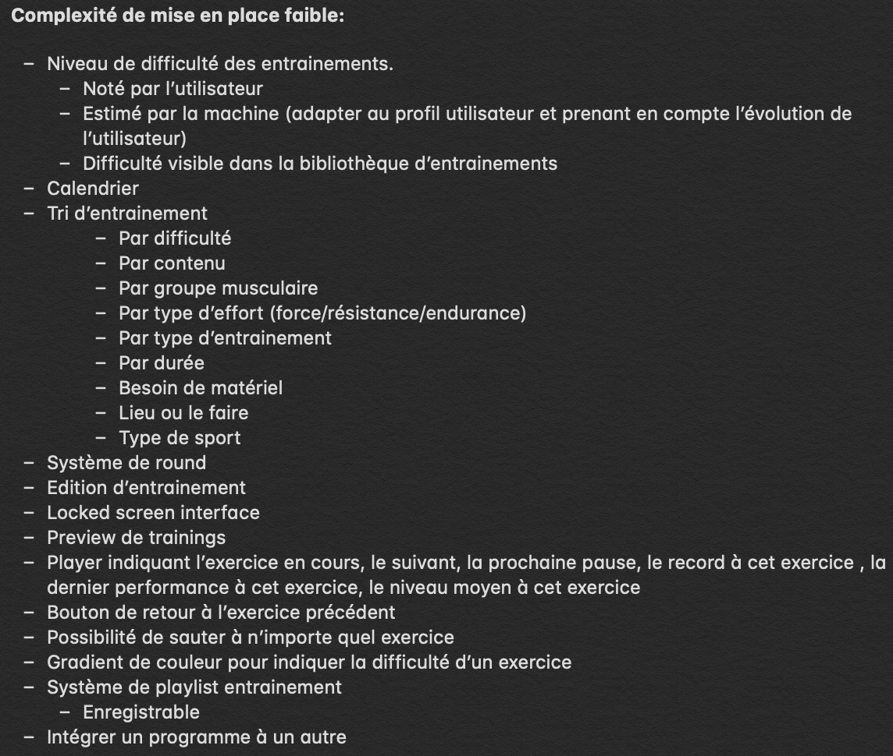
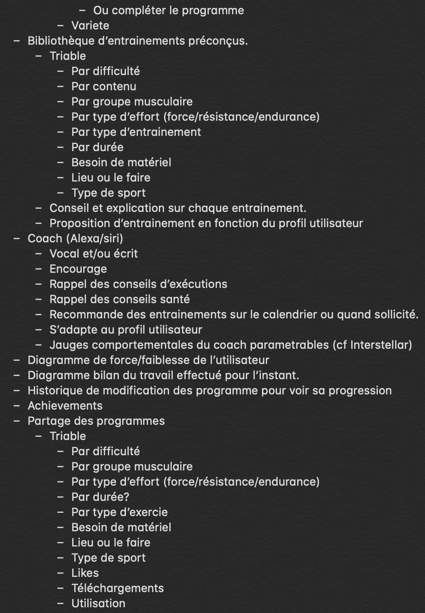
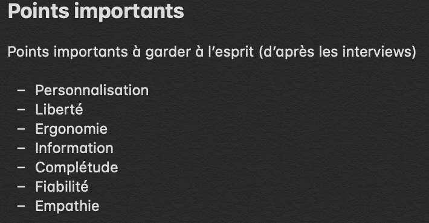

# Coachie

Il s'agit de mon premier projet utilisant les outils et méthodes de l'**UX Design**. Mon but est de concevoir une application permettant d'organiser ses entraînements en les programmant à l'avance.

Dans un premier temps, je fais des recherches sur les méthodes et outils les plus adaptés à mon projet. J'ai choisi de prendre en main **Adobe Xd**. Je me sers de ce que j'ai appris auprès de la **dthinking.academy**, et j'exploite toutes sortes d'informations touvées sur internet. Découvrant encore le domaine, j'alterne l'avancement de mon projet avec des recherches et des lectures.

Je commence par essayer de concevoir un **brief** comparable à ce qu'un client aurait pu m'envoyer, calqué sur un exemple professionel.
Cela me permet, déjà, de voir à quoi ressemble un **brief**, et surtout de poser des bases et des limites à mon projet.

- J'identifie mon **utilisateur**.
- Je définis les premières **features**.
- Je liste des **applications** dont je peux m'inspirer ou qui sont en concurrence avec la mienne. 
- Je fais une liste de **livrables** comme si j'avais un client, cela me permettra de me fixer des objectifs et de construire une chronologie pour mon projet. 
- J'en profite aussi pour fixer des **deadlines** même si je n'ai pas encore la moindre idée du temps que peut me prendre chaques étapes, ni du nombre d'**itérations** qui auront lieu. Ce qui va me permettre de réaliser l'écart qu'il y a entre ce que j'anticipais au début du projet et ce qui est réellement.

Ce **brief** n'a rien de définitif, puisque rien qu'en me limitant en terme de **features**, je passerais à côté de beaucoup d'aspects intéressants de la démarche. Il est voué à être mis à jour.

Ensuite j'élabore un **personna**. Le but est d'avoir un utilisateur type pour bien identifier ses besoins et ne pas concevoir une application pour moi ou pour qui que ce soit d'autre, mais au contraire de bien se focaliser sur la **cible de mon application** et de la garder au centre de la démarche.

 

Je commence à avoir une idée de ce que je veux faire. Je réunis de la docu, quelques tutos, et j'ouvre **Adobe Xd**.
Je réalise un premier **wireframe** en multipliant les aller-retours sur google, pour comprendre le logiciel et exploiter ses outils au mieux tout en essayant de prendre de bonnes habitudes. 
Au bout de quelques heures, j'ai un premier résultat et un premier **userflow** à interroger grâce au mode **prototype** de **Xd**.

Mais le **design** ne me convient pas. La **palette de couleur** et l' **interface** ne sont pas satisfaisante.
Je décide de retourner dans une **phase de recherche**. 
J'améliore ma **palette de couleur**. Je télécharge des ressources mobile pour **Xd**. Notamment, pour ne pas avoir à designer tous les boutons ou icônes moi-même. Cela me fait gagner beaucoup de temps et dans la plupart des cas, la qualité est meilleure que ce que j'aurais fait. J'apprends, au passage, à faire des ajustements sur le travail d'un autre. 
Je télécharge ensuite des applications comparables. J'analyse leur **design**, autant en **micro**, par exemple pour les boutons play/pause qui sont souvent réunis en un bouton, qu'en **macro** quand il s'agit des choix de couleurs ou de l'organisation globale de chaque **frame**. Ne prévoyant presque que des modifications visuelles, je ne me pose pas trop de questions quant à mon utilisateur et je retourne dans **Xd** pour ameliorer mon **wireframe**.

Wireframe | Prototype
------- | -------
 | 

  

Après une première **itération** et une bonne amélioration du **prototype**, je suis globalement satisfait du résultat, je pense que c'est suffisant pour l'instant. Je vais pouvoir commencer à montrer mon application, récolter du **feedback**, **interviewer** des utilisateurs potentiels et mettre en place des **tests utilisateur**.

D'abord, bien que je n'ai pas d'objectif particulier avec ce processus de **research**, je conçois quelques questions pour guider un peu l'**interview** et me soutenir si jamais je perd un peu le file. Je dresse un profil du l'utilisateur puis je questionne au sujet de l'application. Mon but est de créer un **échange**, une discussion. Je veux créer un **lien avec mon utilisateur** et le comprendre, **sentir ses envies et ses besoins**. Je compte moins sur ces questions que sur ma capacité d'**empathie** pour avoir des réponses.

  

Ensuite, j'ai cherché des candidats. J'ai trouvé deux personnes dans mon entourage qui pratique quotidiennement une activité sportive, en tout cas en ce moment, et qui semble y avoir un rapport différent. Nouria, une jeune femme de 22 ans et Raphael, jeune homme de 23 ans. Les **interviews** plus les **test utilisateur** ont durés un peu plus d'une heure à chaque fois. C'était très intéressant et sympathique. J'en ai appris beaucoup sur la vision qu'ils avaient du sport et d'une bonne application. Cependant, peut être parceque mon prototype étant assez peu fonctionnel et abouti ou parceque j'ai eu un peu de mal à guider **l'échange**, il a été difficile d'avoir des retours clairs sur l'application. J'ai reçu plus de propositions pour de **nouvelles features** que **d'avis** ou de **ressentis** sur ce qui était déjà là. Ou en tout cas ils étaient moins précis que les propositions. C'était peut être juste que l'idée de base était convaincante et qu'ils ne se posaient pas de question, ce qui est une très bonne chose.

Nouria | Raphael
------- | -------
 | 

Il y a eu énormément de choses qui en sont ressorties. J'ai décidé de d'abord retenir les **modifications** que j'avais à faire. Ensuite, de bien noter les **points importants** pour mes **utilisateurs** et enfin lister toutes les **nouvelles features** que ces **interviews** ont fait ressortir ainsi que celle que j'ai imaginé pendant ce processus.
Je les ai séparées en deux catégories, celles à **complexité de mise en place faible**, que je peux facilement ajouter un prototype déjà existant et celles à **complexité de mise en place haute**, qui demandent plus de temps pour être **designées** et/ou qui nécessitent un **dévellopement** comparable au prototype actuel et/ou qui requièrent des **connaissances et ressources** que je n'ai que partiellement voir pas.

Notes | Notes
------- | -------
 |
 | 
 | 

